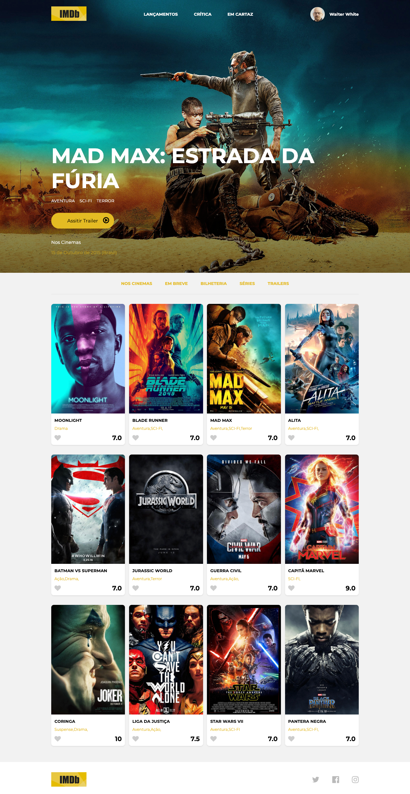

  

<h3 align="center">
AceleraDev - React
</h3>

## 🎥 IMDB 
O desafio é desenvolver a página inicial de um site de avaliação de filmes (IMDB - Internet Movies Database) utilizando apenas   
**HTML5** e **CSS3**.

## O que foi usado:

* HTML5;
* CSS3;
* Vincular fontes externas (Google Fonts);
* Vincular fontes de ícones (Fontawesome).

## Layout

    

  
---
